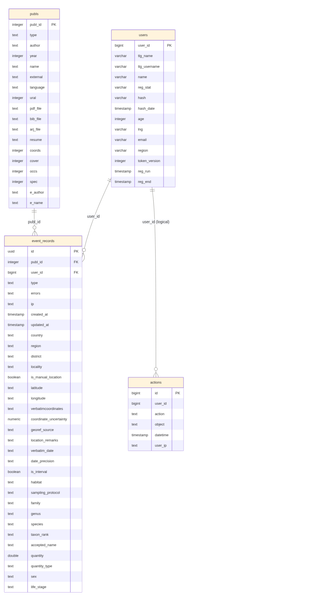
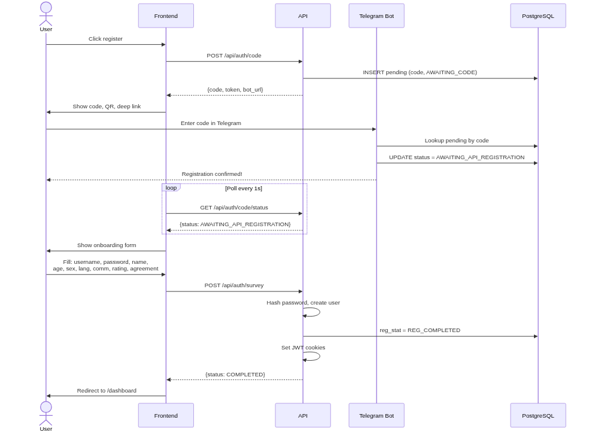
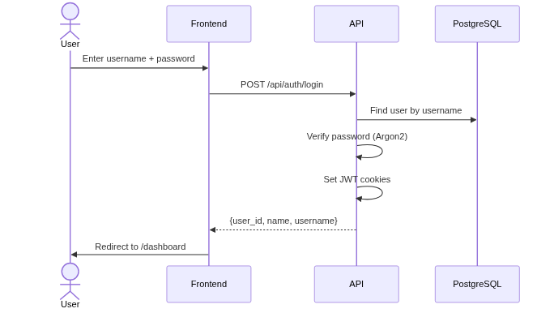
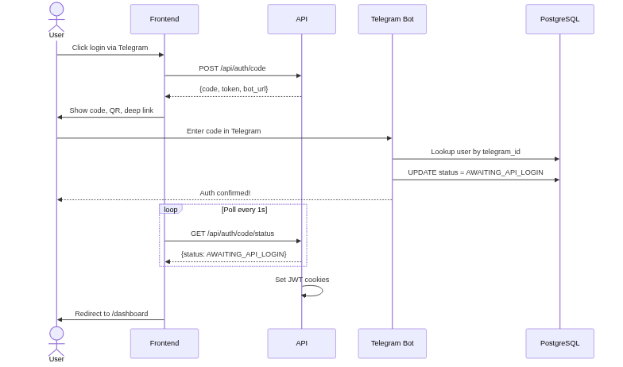
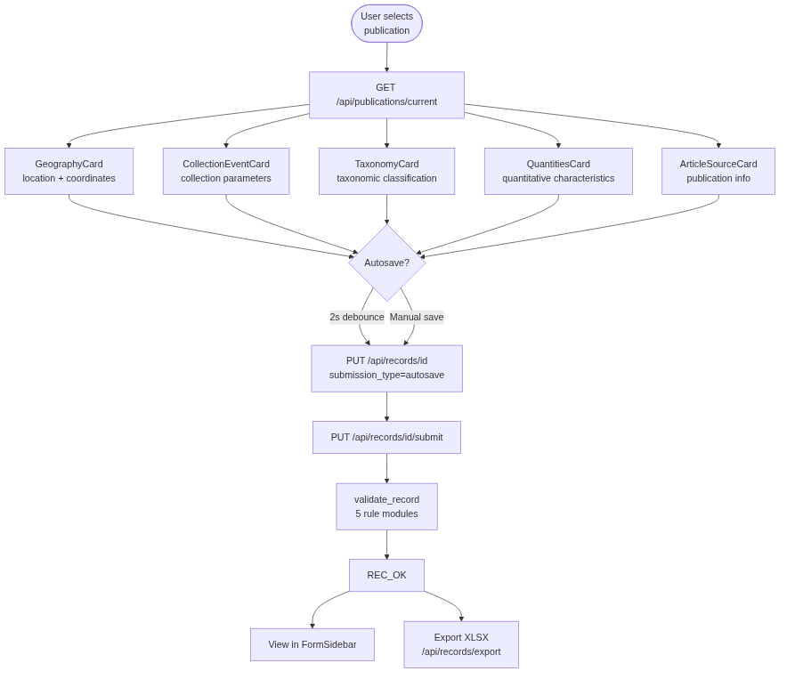
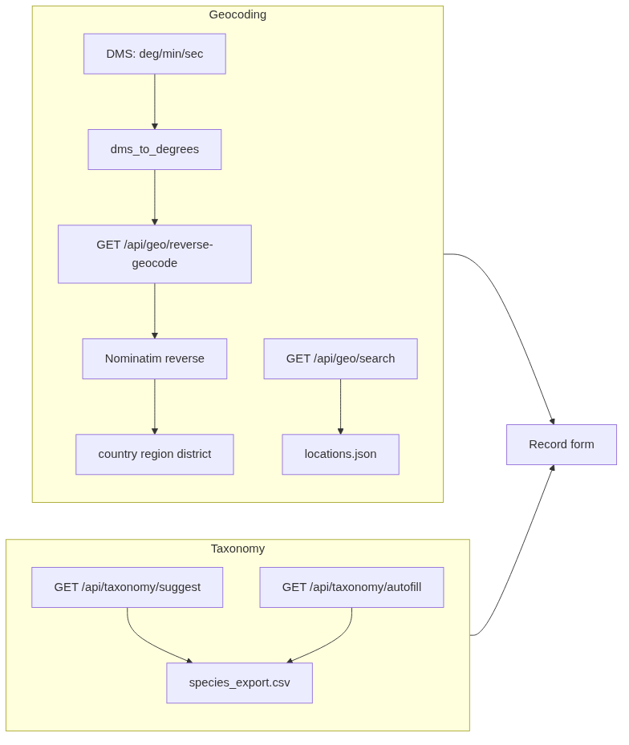
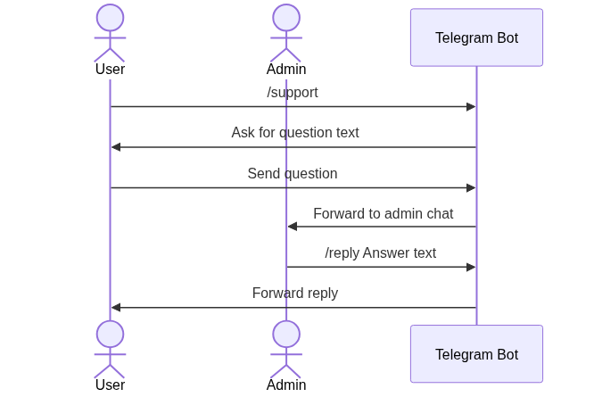

# Архитектура системы (Technical Design Document)

## 1. Структура документа

### 1.1. Общая схема архитектуры (System Context / Container Diagram)
**Контекст:**
- Пользователь‑волонтёр работает через веб‑интерфейс и Telegram‑бот.
- Администратор получает обращения в Telegram‑чат поддержки.
- Система хранит данные в PostgreSQL, выполняет валидацию, геокодирование и экспорт.

**Текстовая схема (контейнеры):**
```
[Пользователь] ──HTTP──> [Frontend (React/Vite)] ──HTTP API──> [Backend (FastAPI)] ──SQL──> [PostgreSQL]
                                     │                                   │
                                     │                                   ├─> [Геокодер Nominatim (geopy)]
                                     │                                   ├─> [Справочники: CSV/JSON]
                                     │                                   └─> [Экспорт XLSX/CSV]
[Пользователь] ──Telegram──> [Telegram Bot (aiogram)] ──DB/API──> [Backend + PostgreSQL]
[Администратор] <─Telegram─ [Support Chat] <─ уведомления ─ [Backend]
```

### 1.2. Стек технологий с обоснованием
**Backend**
- **FastAPI** — асинхронный REST API с валидацией через Pydantic, удобный для сложных форм и быстрой разработки.
- **SQLAlchemy + asyncpg** — надежная работа с PostgreSQL и поддержка сложной модели данных (записи, публикации, действия).
- **Pydantic** — строгие схемы входных данных и формирование ответов API.
- **Alembic** — контроль миграций и эволюции схемы БД.
- **aiogram** — Telegram‑бот с FSM для последовательных сценариев регистрации/поддержки.
- **SlowAPI** — защита от злоупотреблений (rate limit на логин/поддержку/импорт).
- **Pandas + openpyxl** — импорт/экспорт в XLSX/CSV (форматы удобны для научных данных).
- **geopy/Nominatim** — обратное геокодирование координат и заполнение административных полей.

**Frontend**
- **React 19 + Vite** — быстрый SPA для многоэтапного ввода данных и динамических форм.
- **react‑router** — маршрутизация между разделами (главная, форма, профиль, статистика).

**Инфраструктура**
- **PostgreSQL 15** — реляционная БД для структурированных научных данных и связей.
- **Docker Compose** — воспроизводимый запуск БД/pgAdmin локально.

### 1.3. Диаграмма базы данных (ER-диаграмма)
**users**
- **PK**: `user_id`
- Основные поля: `tlg_name`, `tlg_username`, `name`, `reg_stat`, `hash`, `hash_date`,
  `age`, `lng`, `email`, `region`, `token_version`, `reg_run`, `reg_end`.

**publs**
- **PK**: `publ_id`
- Основные поля: `type`, `author`, `year`, `name`, `external`, `language`, `ural`,
  `pdf_file`, `bib_file`, `arj_file`, `resume`, `coords`, `cover`, `occs`, `spec`,
  `e_author`, `e_name`.

**event_records** (основная таблица находок)
- **PK**: `id` (UUID)
- **FK**: `publ_id` → `publs.publ_id`
- **FK**: `user_id` → `users.user_id`
- Группы полей:
  - Метаданные: `type`, `errors`, `ip`, `created_at`, `updated_at`.
  - Локация: `country`, `region`, `district`, `locality`, `is_manual_location`.
  - Координаты: `latitude`, `longitude`, `verbatimcoordinates`, `coordinate_uncertainty`,
    `georef_source`, `location_remarks`.
  - Даты: `verbatim_date`, `date_precision`, `is_interval`.
  - Биотоп/сбор: `habitat`, `sampling_protocol`, `sampling_effort`, `sample_size_value`,
    `sample_size_unit`, `event_remarks`, `field_number`, `catalog_number`,
    `collection_code`, `recorded_by`.
  - Таксономия: `family`, `genus`, `species`, `tax_verbatim`, `taxon_rank`,
    `type_status`, `accepted_name`, `taxon_remarks`.
  - Количество/стадии: `quantity`, `quantity_type`, `sex`, `life_stage`,
    `occurrence_remarks`, `identification_remarks`.

**actions** (журнал действий)
- **PK**: `id`
- Логические связи: `user_id` (users)
- Основные поля: `action`, `object`, `datetime`, `user_ip`.

**spiders** (экспорт DarwinCore)
- **PK**: составной `publ_id + shortlink`
- Основные поля: `scientificname`, `family`, `genus`, `specificepithet`,
  `eventdate`, `locality`, `decimallatitude`, `decimallongitude` и др.

**Основные связи:**
- `users (1) ── (N) event_records` (FK `event_records.user_id`).
- `publs (1) ── (N) event_records` (FK `event_records.publ_id`).
- `users (1) ── (N) actions` (логическая связь по `user_id`).
- `users (1) ── (N) records`, `publs (1) ── (N) records` (логические связи).



### 1.4. Ключевые программные модули
**Backend API**
- **Auth** — логин/логаут, refresh токены, ограничение попыток входа.
- **Users** — профиль пользователя, обновление email/языка, получение фото.
- **Publications** — выдача текущих публикаций, завершение, метаданные, комментарии.
- **Records** — создание, autosave, submit, удаление, импорт/экспорт, валидация.
- **Taxonomy** — подсказки и автозаполнение таксонов по справочнику.
- **Geo** — подсказки регионов и обратное геокодирование координат.
- **Statistics** — агрегированные показатели проекта и пользователя.
- **Support** — отправка обращений в поддержку (Telegram).
- **Actions/Milestones** — логирование действий и достижений пользователей.

**Telegram Bot**
- Регистрация пользователя (согласие, имя, возраст, язык, предпочтения).
- Команды статистики, меню, поддержки.
- Админ‑функции: ответы на обращения и выдача логов.

**Frontend**
- **Главная/Инструкция** — onboarding пользователя и правила заполнения.
- **Форма** — многоэтапный ввод данных (гео/таксоны/материалы).
- **Профиль** — список записей, редактирование, экспорт.
- **Статистика** — проектные метрики и топ‑виды.
- **Обратная связь** — отправка заявки в поддержку.

### 1.5. Ключевые алгоритмы / бизнес‑процессы

**Регистрация**


1. Пользователь нажимает кнопку регистрации на сайте.
2. Фронтенд отправляет `POST /api/auth/code`; API генерирует 6-значный код и session-токен.
3. На сайте отображается код, ссылка на Telegram, QR-код и deep link `?start=CODE`.
4. Пользователь вводит код в Telegram — через `/confirm`, `/register`, `/start <code>` (deep link) или автоматически по вводу 6 цифр.
5. Бот находит pending-регистрацию по коду и проверяет, существует ли пользователь в БД:
   - **Существующий пользователь**: статус → `AWAITING_API_LOGIN`.
   - **Новый пользователь**: статус → `AWAITING_API_REGISTRATION`, сохраняются `telegram_id`, `telegram_name`, `telegram_username`, `reg_run`.
6. Фронтенд каждую секунду (до 25 с) опрашивает `GET /api/auth/code/status?code=&token=&time_out=25`:
   - `AWAITING_API_LOGIN` (1) → API устанавливает `access_token` и `refresh_token` как HTTP-only cookies, фронтенд редиректит на `/dashboard`.
   - `AWAITING_API_REGISTRATION` (2) → фронтенд показывает форму Onboarding.
   - При истечении кода API автоматически генерирует новый (`refresh_code`).
7. Форма Onboarding: `username`, `password`, `name`, `age`, `sex`, `lang`, `comm`, `rating` (согласие на публичность), `agreement` (подтверждение).
8. После отправки `POST /api/auth/survey` API хеширует пароль (Argon2), создаёт пользователя (`reg_stat=REG_COMPLETED`), устанавливает HTTP-only JWT cookies.

Токены: `access_token` (короткий) + `refresh_token` (долгий), оба — HTTP-only cookies. Ротация через `POST /api/auth/refresh`. Инвалидация через `token_version`.

Rate limits: */code* — 3/мин, */code/status* — 3/мин, */survey* — 3/мин.

**Авторизация**

*Способ 1 — логин/пароль:*


1. Пользователь вводит `username` и `password`
2. `POST /api/auth/login` (5/мин): API ищет пользователя, сверяет пароль (Argon2 / legacy MD5), проверяет `reg_stat`.
3. При успехе — `set_response_token_cookies()` устанавливает `access_token` + `refresh_token` как HTTP-only cookies (`httponly=True`, `samesite=strict`, `path=/api`).
4. Ответ: `{user_id, name, username}` (без токена в теле).

*Способ 2 — через Telegram:*


1. Фронтенд вызывает `POST /api/auth/code` — получает код и токен.
2. Пользователь вводит код в боте.
3. Бот находит пользователя в БД по `telegram_id`, устанавливает статус `AWAITING_API_LOGIN`.
4. Фронтенд опрашивает `GET /api/auth/code/status` — API обнаруживает `AWAITING_API_LOGIN`, выдаёт JWT cookies, редирект на `/dashboard`.

**Заполнение записи**


1. Пользователь выбирает публикацию на `/dashboard` (`GET /api/publications/current`).
2. Заполняет блоки формы (реализованы как карточки):
   - **GeographyCard** — пространственная локализация + координаты (единый блок);
   - **CollectionEventCard** — параметры сбора материала;
   - **TaxonomyCard** — таксономическая классификация;
   - **QuantitiesCard** — количественные характеристики;
   - **ArticleSourceCard** — информация о публикации (отображается, но не редактируется).
3. Автосохранение (`useAutoSave`): debounce 2 с, `PUT /api/records/{id}` с `submission_type=autosave`. Оптимистичная блокировка по `previous_update=updated_at`.
4. Submit: `PUT /api/records/{id}/submit`. Валидация через 5 модулей правил (abundance, event, geo, location, taxonomy).
5. Тип записи определяется комбинацией ошибок + submission_type:
   - `REC_OK` / `REC_FAIL` (submit) или `CHECK_OK` / `CHECK_FAIL` (autosave).
6. Результаты видны в `FormSidebar` (список записей публикации) и на странице `/statistics` (с экспортом).
7. Экспорт: `GET /api/records/export?publ_id=X` (по публикации), `GET /api/records/export-all` (все записи пользователя) — XLSX.

**Геокодирование и таксономия**


- **DMS → десятичные градусы**: `geo.dms_to_degrees(deg, min, sec)` — вызывается перед обратным геокодированием.
- **Обратное геокодирование**: `GET /api/geo/reverse-geocode` → `geopy.Nominatim.reverse()` (10 запросов/с, JWT).
- **Подсказки регионов**: `GET /api/geo/search?field=region|district&query=...` — фильтрация `locations.json`.
- **Подсказки таксонов**:
  - `GET /api/taxonomy/suggest` — поиск по `species_export.csv` (field, query, family, genus).
  - `GET /api/taxonomy/autofill` — авто-заполнение family/genus по точному совпадению.
- **Дополнительно**: проверка вхождения в Уральский регион (`ural_border.geojson`).

**Поддержка**


- Фронтенд (`/support`) показывает deep link на Telegram-бота и QR-код; форма на сайте **не используется** (endpoint `POST /api/support` существует, но не задействован в UI).
- Пользователь отправляет `/support` в боте → бот запрашивает текст вопроса (10–256 символов) → пересылает в `ADMIN_CHAT_ID`.
- Администратор отвечает через `/reply <текст>` или просто ответом на сообщение (plain text).
- Команда `/logs` — просмотр недавних обращений.

## 2. Заключение
Архитектура Faunistica_4.0 разделяет ответственность между веб‑клиентом, API и Telegram‑ботом, что упрощает масштабирование и поддержку. PostgreSQL хранит структурированные данные находок, а сервисы геокодирования и таксономии обеспечивают качество и единообразие записей. Логирование действий и валидация на уровне API повышают надежность, а экспорт в табличные форматы делает систему удобной для последующей научной обработки.