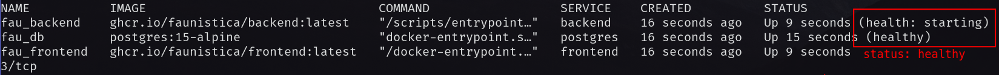
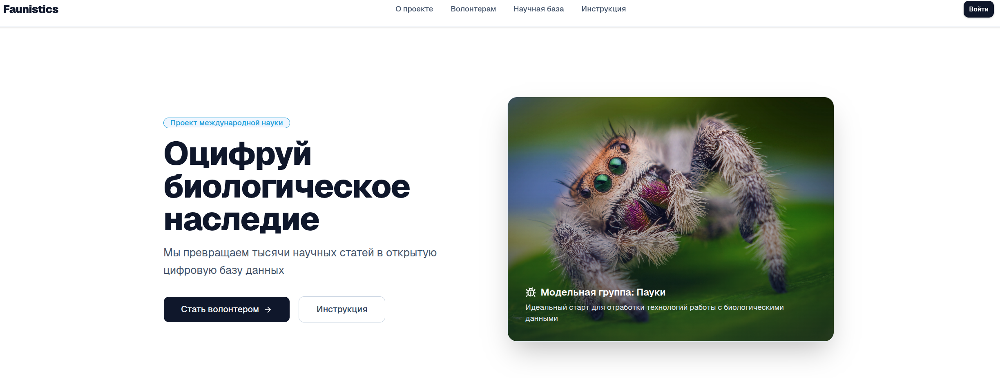
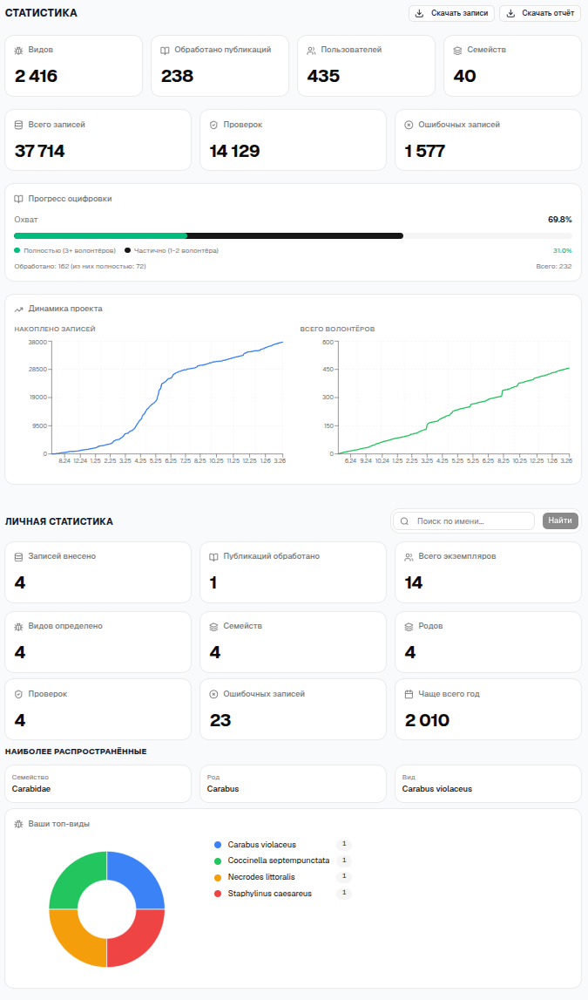
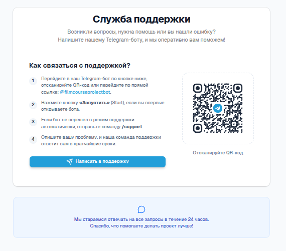
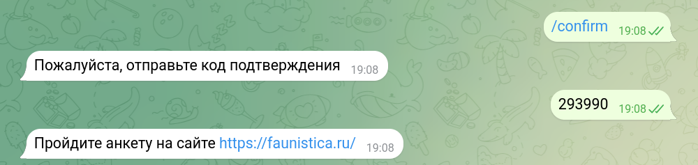
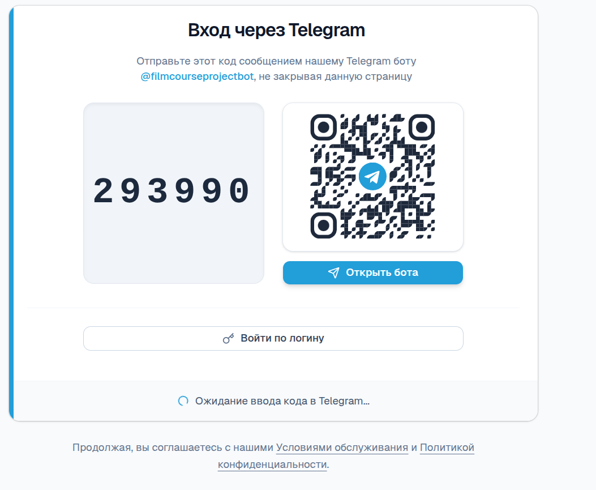
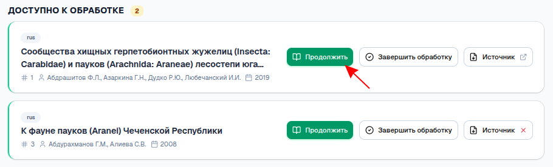
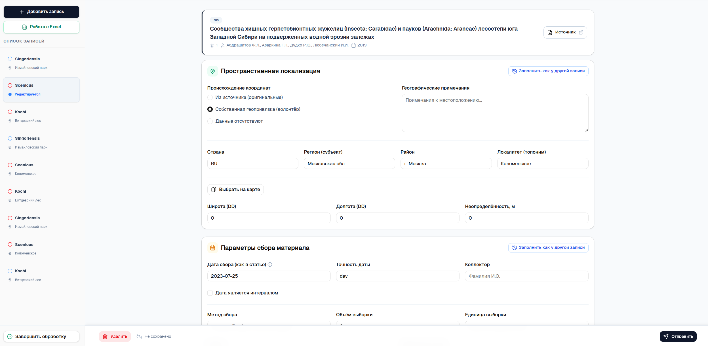
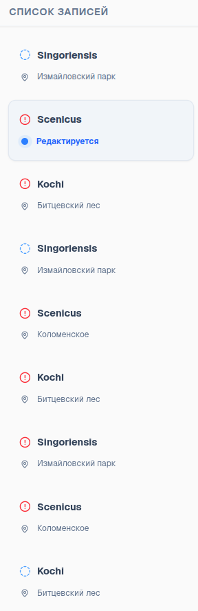
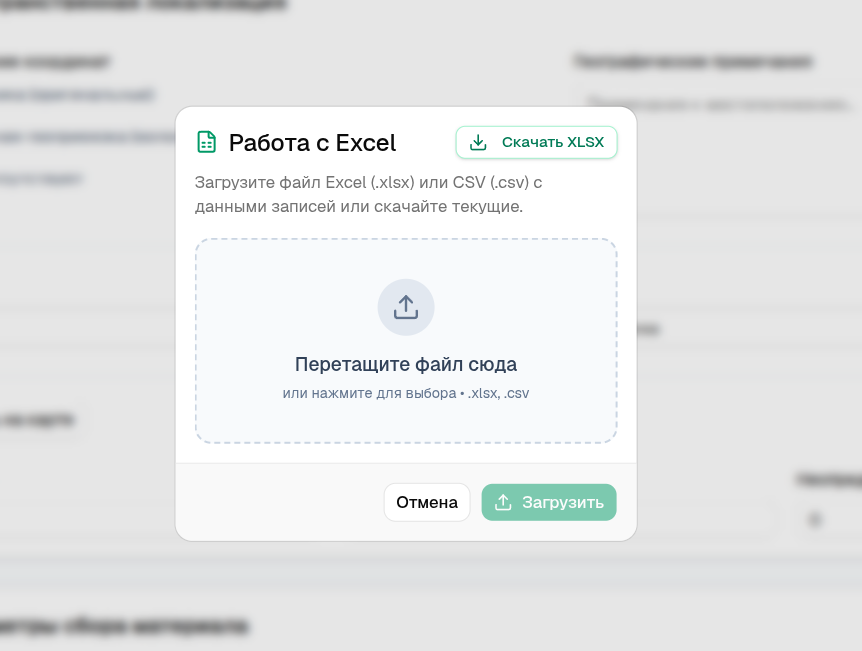

# Руководство пользователя (User Guide)

## 1. Часть 1: Руководство администратора

### 1.1. Системные требования

**Сервер:**
- CPU: x86_64, 2 ядра, 2.3 GHz.
- RAM: 2 ГБ.
- Диск: SSD, 7 ГБ.
- Публичный IP-адрес.
- ОС: Ubuntu 20.04 или выше.

**ПО:**
- Python 3.13+.
- PostgreSQL.
- Node.js 22+.
- pnpm.
- uv (менеджер пакетов Python).
- Git.

**Клиентская часть** совместима с браузерами: Яндекс Браузер, Google Chrome, Opera, Microsoft Edge, Firefox.

### 1.2. Инструкция по развёртыванию (Deploy)

Поддерживаются два варианта развёртывания: **all-docker** (всё в контейнерах)
и **hybrid** (PostgreSQL и nginx — на хосте, бэкенд и фронтенд — в Docker).
Примеры конфигураций находятся в `examples/`.

**Шаг 1. Клонирование проекта**
1. `git clone <repo>`
2. Перейти в корень проекта.

**Шаг 2. Выбор варианта развёртывания**

*all-docker:*
```bash
cd examples/all-docker
cp ../.env.example .env
cp ../config.yaml .
```

*hybrid:*
```bash
cd examples/hybrid
cp ../.env.example .env
cp ../config.yaml .
# Скопировать nginx/faunistica.conf в /etc/nginx/sites-available/
```

**Шаг 3. Заполнение `.env`**

Обязательные переменные:

| Переменная       | Описание                            |
|------------------|-------------------------------------|
| `BOT_TOKEN`      | Токен Telegram-бота                 |
| `ADMIN_CHAT_ID`  | ID чата администратора              |
| `DB_NAME`        | Имя базы данных                     |
| `DB_HOST`        | Хост БД (или путь к Unix-сокету)    |
| `DB_PORT`        | Порт БД                             |
| `DB_USER`        | Пользователь БД                     |
| `DB_PASSWORD`    | Пароль БД                           |
| `JWT_SECRET`     | Секрет для JWT (мин. 32 символа)    |

Опциональные переменные (можно задать в `config.yaml`):

| Переменная                    | По умолчанию | Описание                              |
|-------------------------------|--------------|---------------------------------------|
| `ACCESS_TOKEN_EXPIRE_MINUTES` | 30           | Время жизни access-токена             |
| `REFRESH_TOKEN_EXPIRE_DAYS`   | 30           | Время жизни refresh-токена            |
| `PASSWORD_EXPIRE_MINUTES`     | 1440         | Срок действия временного пароля       |
| `GLOBAL_RATE_LIMIT`           | 100/minute   | Глобальный rate limit для /api/       |
| `LOG_LEVEL`                   | WARNING      | DEBUG / INFO / WARNING / ERROR        |
| `DB_ECHO`                     | false        | Логировать SQL-запросы                |
| `BOT_PROXY`                   | (нет)        | SOCKS5/HTTP прокси для бота           |

Альтернатива `.env` в production — **Docker secrets**: смонтировать файлы
в `/run/secrets/<ИМЯ_ПЕРЕМЕННОЙ>`. Приоритет источников (от высшего к низшему):
переменные окружения → `.env` → Docker secrets → `config.yaml`.

**Шаг 4. Запуск**
```bash
docker compose up -d
```
Проверить, что контейнеры `postgres`, `backend`, `frontend` в статусе healthy.



**Шаг 5. Миграции БД**

Миграции выполняются автоматически при запуске контейнера (`alembic upgrade head` в entrypoint.sh).

**Шаг 6. Тестовые данные (опционально, только для dev)**
```bash
./init.sh
```
Создаёт пользователя `DEV_USERNAME` с паролем `password`.

**Шаг 7. HTTPS (опционально, hybrid)**
```bash
certbot certonly --standalone -d <домен>
```
Раскомментировать блок `listen 443` в `nginx/faunistica.conf` и перезагрузить nginx.

---

### 1.3. Панель администратора

Управление осуществляется через Telegram-бота. Доступные команды:
- `/reply` — ответить пользователю (как ответ на его сообщение).
- `/logs` — получить лог-файлы за дату (`YYYY-MM-DD` или `сегодня`).

## 2. Часть 2: Руководство пользователя

### 2.1. Обзор интерфейса
- **Главная** — описание проекта и вход.


- **Инструкция** — пошаговая помощь по регистрации и заполнению форм.
- **Форма** — основная рабочая область для ввода данных о находке.
- **Профиль** — личная статистика, настройки, экспорт.


- **Статистика** — общая статистика по проекту.


- **Обратная связь** — отправка обращения в поддержку.



### 2.2. Типовые сценарии (How‑to)
**Сценарий 1: Регистрация**
1. Открыть сайт, перейти в раздел «Регистрация».
2. Нажать «Регистрация через Telegram» → получить 6-значный код. Отправить код в Telegram-бота (`@FaunisticaV4Bot`, команда `/start <код>` или `/confirm <код>`).



3. Бот подтверждает код → на сайте открывается анкета (аналогична настройкам профиля на скриншоте выше). Заполнить: имя, логин, пароль, возраст, пол, языки, предпочтения.
4. Нажать «Завершить регистрацию» → автоматический вход в систему.

**Вход для уже зарегистрированных:**
- Вариант А: тот же Telegram-флоу (шаги 1-2 → автовход без анкеты).
- Вариант Б: логин/пароль на странице входа.



**Сценарий 2: Заполнение новой записи**
1. Перейти в раздел «Форма».
2. Выбрать публикацию.



3. Заполнить блоки: административный, географический, сбор материала, таксономия.



4. Отправить запись на проверку.

**Сценарий 3: Редактирование записи**
1. Перейти в раздел «Форма».
2. Выбрать запись из списка в боковой панели.



3. Внести изменения и сохранить.

**Сценарий 4: Экспорт данных**
1. В «Профиле» нажать «Скачать записи».



2. Получить файл `records.xlsx`.

**Сценарий 5: Обращение в поддержку**
1. Открыть «Обратная связь».
2. Указать Telegram‑ник и описание проблемы.
3. Отправить заявку — ответ придёт в Telegram.

### 2.3. FAQ
**Q: Не получается войти на сайт.**
A: Убедитесь, что регистрация в Telegram завершена и введены корректные логин/пароль.

**Q: Форма не отправляется.**
A: Проверьте обязательные поля и формат координат/дат.

**Q: Экспорт не запускается.**
A: Проверьте авторизацию и наличие записей в профиле.

**Q: Куда писать при проблемах?**
A: Используйте раздел «Обратная связь» на сайте или команду `/support` в боте.
